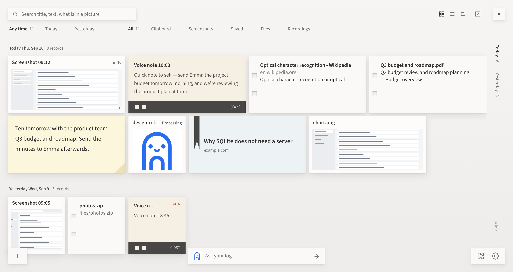

# briffy 📎

[](https://github.com/jiaazhaoo/briffy/releases)
[](https://github.com/jiaazhaoo/briffy/releases)
[](LICENSE)

**A paperclip that writes down what you saw, heard and were handed.**

briffy sits in the corner of your screen. Click it to capture, drop things on it, or just
copy — it files everything into one folder a day, reads the words out of your screenshots,
transcribes your voice notes, and lets you ask about any of it later. Recognition runs on
your machine, and it works with the network off.

**[Download](https://github.com/jiaazhaoo/briffy/releases)** · [briffy.cc](https://briffy.cc) ·
[中文](docs/README.zh.md)



## Install

Download the [latest release](https://github.com/jiaazhaoo/briffy/releases) — macOS (Apple
Silicon) or Windows. Nothing to configure: the first launch checks the machine and prepares the
local OCR and speech engines itself.

From source:

```bash
npm install     # fetches the Electron runtime, once
npm start
```

## Gestures

| Do this | Get this |
| --- | --- |
| **Click it** | Full screen — saved, OCR'd, on your clipboard |
| **Double-click** | Drag a box. **Long shot** scrolls the window and joins a whole page |
| **Middle-click** (or hold 0.55 s) | Start / stop a voice note |
| **Drop** an image, file, link, text | Into the workspace — images get OCR, PDFs and pages their text |
| **Copy** anything | Text, images and files land in the workspace as you copy them |
| `Ctrl+Alt+A / S / V` (`⌘⇧A / S / V`) | Box · full screen · voice note |
| `Alt+Shift+D` in the browser | The extension lists the page's images, video and audio |

## What it does

- **Everything names itself** — a title and a sentence. Each morning it writes up yesterday.
- **Ask your log** — briffy picks the records locally, then a model reads only those and cites
  each one. Asking works offline, and with no provider configured at all.
- **Search that also finds the near misses** — exact hits, plus records that only *mean* the same
  thing, always labelled as such.
- **Filter by the five kinds of paper** — Clipboard, Screenshots, Saved, Files, Recordings, each
  with its own second level: a site, an app, a file type, a microphone.
- **Local everything** — OCR is PP-OCRv6, speech is Whisper, both through onnxruntime.

## Your data

One folder, `~/Library/Application Support/briffy/workspace` (or `%APPDATA%\briffy\workspace`),
movable from Settings. Originals are never rewritten. Deleting the app does not delete it.

**Pictures are never sent to a model** — OCR already read the words. Whatever *is* sent has card
numbers, ID numbers, keys and passwords masked first, by checksum and fixed shape, no model
involved. Your stored records are never altered.

## Docs

[Why it works this way](docs/NOTES.md) · [Privacy](docs/PRIVACY.md) ·
[Packaging and release](docs/RELEASE.md) · [Give an agent your workspace](mcp/README.md) ·
[Contributing](CONTRIBUTING.md) · [Security](SECURITY.md)

Preview the UI without building anything: `node dev/preview/serve.js`, then `/`, `/pet`,
`/viewer`, `/onboarding` — real CSS and JS, mock data. `npm test` runs the checks.
House rules are in [CLAUDE.md](CLAUDE.md).

## License

[PolyForm Noncommercial 1.0.0](LICENSE) — free for personal use, study, research and non-profits;
**commercial use needs a licence** (<zhaojia789456@gmail.com>). Source-available, not OSI open
source. Dependencies keep their own licences ([THIRD-PARTY.md](THIRD-PARTY.md)). The name and the
drawing are not licensed with the code — fork it and ship it under another name.
